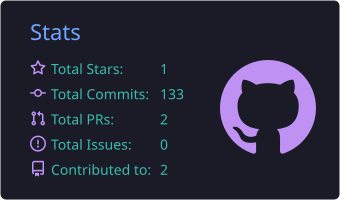
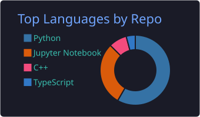

<h1 align="center">Hello 👋, I'm Aya Hazem</h1>

<h3 align="center">AI Engineer · Generative AI · Machine Learning · Software Engineering</h3>

  
  

 

## 📊 GitHub Stats

  

---
## 👩‍💻 About Me

* 🎓 Bachelor's degree in **Computers and Control Systems Engineering, Mansoura University**
* 🤖 AI Engineer focused on **LLMs, Generative AI, RAG, AI Agents, Machine Learning & Computer Vision**
* 🏗️ Build **end-to-end AI products**, from data and models to APIs, applications and deployment
* ⚙️ Software Engineer experienced in **backend systems, REST APIs, databases, integrations and web applications**
* 🧠 Interested in **AI system architecture, agentic workflows, RAG, multimodal AI and production AI systems**

---
### 🧠 AI / ML

`LLMs` · `RAG` · `AI Agents` · `Computer Vision` · `NLP` · `Speech` · `Generative AI` · `OCR`

`Hugging Face` · `OpenAI` · `Gemini` · `LangChain` · `LangGraph` · `Ollama` · `Modal` · `Qdrant` · `Pinecone` · `MCP`

### 🏗️ Software Engineering

### ☁️ DevOps & Deployment

`Docker` · `Docker Compose` · `CI/CD` · `AWS` · `Google Cloud` · `Azure` · `VPS` · `Linux`

---

## 🚀 What I Built

**Full-stack AI applications** — complete products with frontend, backend APIs, databases, auth and deployment — not chat demos alone.

**Process-driven conversational agents** — assistants that run real end-to-end business flows inside the conversation, for example:
- **E-commerce** — browse products, create/manage cart, checkout, payment gateway links, order tracking
- **Scheduling** — book, reschedule and manage appointments
- **Sales & leads** — qualify prospects, capture leads, answer product/property questions, hand off to humans

**RAG & agentic systems** — knowledge-grounded chatbots and multi-step agents connected to business data, tools, WhatsApp/webhooks and external APIs.

**Document & multimodal AI** — OCR, document processing, semantic retrieval, image/video understanding and content generation.

